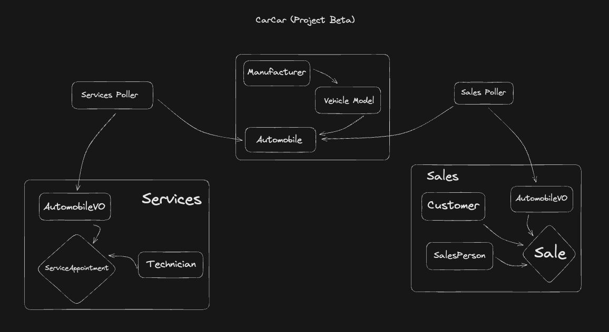

# CarCar

Team:

* Joon Hyuk Brandon Jang - Sales Microservice
* Ramon Duarte - Services Microservices

## Design

In our project's backend, we have three main bounded contexts: Inventory, Sales, and Services. To collect information on Automobiles, Sales and Services poll from Inventory. This allows the creation of AutomobileVO objects.



The front end makes its API calls from the App.js file and the returned data is migrated to the front end. Upon completion of a form, additional "GET" and "PUT" requests are made to update accordingly.


## Instructions

1. Navigate to https://gitlab.com/Krze44/car-car-project-beta and fork the project
2. Clone the repo using the HTTPs link
3. Navigate to a project folder, or your designated folder and clone the project using the cd commands in your terminal
4. In your terminal, run `git clone https://gitlab.com/your-user-name/your-project-name-here`
5. Navigate to the cloned repo directory, and run docker desktop
6. Run `docker volume create beta-data`
7. Run `docker-compose build`
8. Run `docker-compose up`
9. Once the docker container for *react=1* starts successfully, navigate to the main page on your browser, and go to "http://localhost:3000/"
10. The navbar will have links that direct to the indicated services.
11. Once a link has been selected, you wil be directed to a page containing a list of objects, in a card format, as well as a create button that will drop down a modal to create a new object.

## Service microservice

* Ramon Duarte Ruiz

    * Port - `8080:8000`

    * URL - http://localhost:8080/api/

    ## Models and CRUD

    The Services microservice consists of 3 models (one of the models being a value object, or a VO, that uses a poller to fetch data)

    ## Technician

    * Consists of *first name, last name, and employee id*.

        ## CRUD

        * `GET` - http://localhost:8080/api/technicians/ this will retrieve a list of all of the technicians

        * `POST` - http://localhost:8080/api/technicians/ this will allow you to create a new technician by filling in the first name, last name, and employeee id using these fields:

        ```
        {
            "first_name": "Ramon",
            "last_name": "Duarte",
            "employee_id": "drnkfist",
        }
        ```

        the employee id must be a unique string.

        * `GET` - http://localhost:8080/api/technicians/(id)/ this will retrieve the technician details of a specific technician

        * `PUT` - not supported

    ## Appointments

    * Consists of *date and time, appointment reason, appointment status, automobile vin, customer, and technician* This model uses a foreign key to access the data of the technician as well as the AutomobileVO for the vin.

        ## CRUD

        * `GET` - http://localhost:8080/api/appointments/ this will retrieve a list of all the appointments

        * `POST` - http://localhost:8080/api/appointments/ this will allow you to create a new appointment by filling in the date_time, reason, customer, technician, vin using these fields:

        ```
        {
            "date_time": "2023-05-05T12:30",
            "reason": "Oil Change",
            "customer": "Sahar Habashi",
            "technician": "drnkfist",
            "vin": "KFGHWE46BDFG87RGT"
        }
        ```

        The vin entry must be 17 digits long to meet the requirements. This represents the standard amount of digits that a cars vin has.

        * `GET` - http://localhost:8080/api/appointments/(id)/ this will retrieve the appointment details of a specific appointment

        * `DELETE` - http://localhost:8080/api/appointments/(id)/ this will take the id and delete the appointment associated with it

        * `PUT` - http://localhost:8080/api/appointments/(id)/finish/ this will change the status of the appointment associated with the id from created to finished

        * `PUT` - http://localhost:8080/api/appointments/(id)/cancel/ this will change the status of the appointment associated with the id from created to cancelled

    ## AutomobileVO

    * This gives us the VIN number and whether or not the car was sold. This is a value object.

    ## Poller

    * Every 60 seconds a GET request is made to: "http://inventory-api:8000/api/automobiles/"

    * returns a list of objects that are JSON automobile objects

## Sales microservice

* Joon Hyuk Brandon Jang

    * Port - `8090:8000`

    * URL - http://localhost:8090/api/

    ## Models and CRUD

    The Sales microservice consists of 4 models (one of which is a VO, value object, which depends on the poller to migrate data)

    ## SalesPerson

    * Consists of *first name, last name, and employee id*.

        ## CRUD

        * `GET` - http://localhost:8090/api/salespeople/ retrieves a list of all salespeople

        * `POST` - http://localhost:8090/api/salespeople/ takes a first name, last name, and employee id, returning a newly created object with the same fields:

            ```
            {
                "first_name": "Brandon",
                "last_name": "Jang",
                "employee_id": "pnappl"
            }
            ```

            The employee id has to be a unique string.

        * `GET` - http://localhost:8090/api/salespeople/(id)/ retreives a specific salesperson with the matching id

        * `DELETE` - http://localhost:8090/api/salespeople/(id)/ returns a specific deleted salesperson with the matching id

        * `PUT` - not supported

    ## Customer

    * Consists of *first name, last name, address, and phone number*.

        ## CRUD

        * `GET` - http://localhost:8090/api/customers/ retrieves a list of all customers

        * `POST` - http://localhost:8090/api/customers/ takes a first name, last name, address, and phone number, returning a newly created object with the same fields:

            ```
            {
                "first_name": "Stephanie",
                "last_name": "Sun",
                "address": "1234 Los Angeles Ave, CA 90035",
                "phone_number": "123-456-7890"
            }
            ```

            The phone_number entry has to meet the requirement of 10 digits. This is a representation of the standard 10 digit phone number in the states.

        * `GET` - http://localhost:8090/api/customers/(id)/ retrieves a specific customer with the matching id

        * `DELETE` - http://localhost:8090/api/customers/(id)/ returns a specific deleted customer with the matching id

        * `PUT` - not supported

    ## Sale

    * Consists of *price, customer first name, salesperson employee id, and automobile vin.* This model uses a foreign key to access the data of Salesperson, Customer, and AutomobileVO objects.

        ## CRUD

        * `GET` - http://localhost:8090/api/sales/ retreives a list of all sales

        * `POST` - http://localhost:8090/api/sales/ takes an AutomobileVO VIN, salesperson employee id, customer first name, and price, returning a newly created object with the same fields:

            ```
            {
                "automobile": "3GCROGBBCBBY11372",
                "salesperson": "pnappl",
                "customer": "Stephanie",
                "price": "140,000"
            }
            ```

            The price value accepts any characters to accomodate the comma for thousands, and millions. In the model field for price, I used CharField to allow the user to input commas, and the webpage will display *"$"* automatically.

        * `GET` - http://localhost:8090/api/sales/(id)/ retrieves a specific sale with the matching id

        * `DELETE` - http://localhost:8090/api/sales/(id)/ returns a specific deleted sale with the matching id

        * `PUT` - not supported

    ## AutomobileVO

    * Consists of a *VIN number*. This is a value object, so *it is not referenced outside of the sales microservice, poller, and has no API endpoint*.

    ## Poller

    * A GET request is made every 60 sec using the request module to: "http://inventory-api:8000/api/automobiles/"

    * The endpoint for the backend is: "http://localhost:8100/api/automobiles/"

    * Returns a list of JSON Automobile objects, loops over each object in the list, and uses the update_or_create() method to create a new/ update an existing Automobile object.
